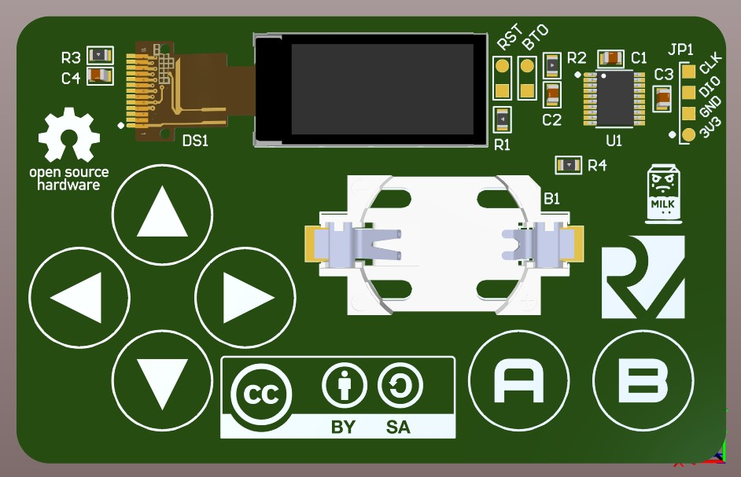

# DevCard - The Mini Game Business Card

Welcome to DevCard, the ultimate mini game business card for electronics engineers and hardware tinkerers. Designed with the modern professional in mind, DevCard offers a unique and interactive way to showcase your skills and make a memorable impression.

## PCB Design

Here are 3D renders of the DevCard PCB:

*Top view of the DevCard PCB*

*Bottom view of the DevCard PCB*

## Features

- **Mini Game Functionality**: Equipped with a 0.96" IPS display and driven by the CH32V203F6P6 microcontroller, DevCard brings a fun and engaging mini game experience right to your pocket.
- **Compact and Portable**: With the same dimensions as a credit card, DevCard fits perfectly in any wallet, ensuring you always have a unique way to showcase your engineering skills.
- **Powered by Coin Cell**: Utilizing a 3V coin cell battery, DevCard is both portable and easy to power, making it ideal for on-the-go demonstrations.

## Getting Started

To experience DevCard, simply insert a coin cell. The 0.96" IPS display will light up, and you can start playing the pre-installed mini game immediately. The device is designed to be intuitive and user-friendly, requiring no additional software or app installation.

## Design and Development

DevCard is more than just a business card; it's a showcase of engineering prowess. From the choice of the CH32V203F6P6 microcontroller to the custom-designed mini game and the compact, efficient layout, every aspect of DevCard has been carefully crafted to demonstrate high-level electronics engineering and layout skills.

### Components

- **Microcontroller**: CH32V203F6P6 TSSOP20
- **Display**: 0.96" IPS TFT LCD Screen (80x160 resolution, ST7735 driver IC)
- **Power Source**: 3V Coin Cell Battery
- **Additional Components**: Various resistors and capacitors for optimal circuit performance

## Usage

- **Networking**: Make a lasting impression at conferences, meetings, and industry events with a unique and interactive business card.
- **Showcase**: Demonstrate your hardware design and electronics engineering skills in a fun and engaging way.
- **Inspiration**: Inspire fellow engineers and tinkerers with the innovative use of miniaturized gaming technology.

## Prototype Components and Costs

For the initial prototype batch (10 units), the following components were purchased:

- **Programming and Debugging Tools**:
  - WCH LinkE: $4.82

- **Core Components for DevCard**:
  - 10x 0.96" IPS TFT LCD Screen Modules: $8.20
  - 10x CH32V203F6P6 Microcontrollers: $3.96
  - 0805 SMD Resistor Kit (660 pieces, 33 values): $1.38
  - 0805 SMD Capacitor Kit (36 values, 1pF-10uF, 220 pieces): $2.35

## Assembly Instructions

1. **Prepare the Components**: Organize all the resistors, capacitors, microcontrollers, and display modules.
2. **Solder the Microcontroller**: Carefully solder the CH32V203F6P6 microcontroller onto the PCB.
3. **Connect the Display**: Solder the 0.96" IPS TFT LCD screen to the designated pins on the microcontroller.
4. **Add Passive Components**: Place and solder the necessary resistors and capacitors as per the circuit design.
5. **Attach the Battery Holder**: Secure the 3V coin cell battery holder to the PCB.
6. **Program the Microcontroller**: Use the WCH LinkE programmer to upload the mini game code to the microcontroller.
7. **Test the Device**: Insert the coin cell battery, and verify that the display and game function correctly.

---

DevCard: Where engineering meets innovation and fun.